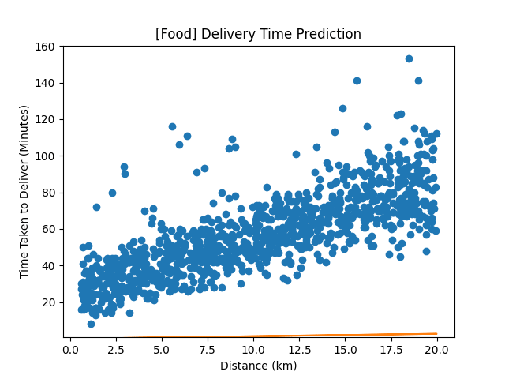

# Linear Regression from Scratch

This is a implementation of simple linear regression from the ground-up, including a visual animation that illustrates the convergence of the best-fit line during the training process. The model is applied to the Food Delivery Time Predictions dataset, sourced from Kaggle.

The primary objective is to model the relationship between delivery time and distance. After some context analysis, it becomes clear that this type of relationship is most likely to be linear, making linear regression an appropriate tool. It demonstrates the core concepts of linear regression, and also provides a practical framework for real-world applications, such as offering customers an estimate of delivery time based on the distance from the restaurant, which is a very common form of feedback.
